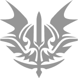

# 🥁 Lore

> _**The world that you perceive is not the only world in existence.**_


Chapter 1: Intro


**IntoTheVerse** is a  pixel replication of the real world we live in. People live in a crypto-native city in various aspects of life. The city has banks, museums, shops, farms, recreational avenues, etc.

But until recently, not everyone inside this Verse knew that there's a whole other world existing just beneath their surface. The knowledge of this hidden underground world had been known to a few and had been concealed from the rest.

Since the dawn of time, otherworldly creatures which we generally confuse with demons or monsters have been living there in peace, unknown about the fact that humans inhabited a city above the surface. Neither they tried to come up to the surface, nor the people have the means to dig deep enough to find about them. Both worlds remained completely aloof.


Chapter 2: The Legend of IntoTheVerse


But all this changed around 500 years ago when two explorers Eli and Rame stumbled upon a deep tunnel in the middle of the unknown dark forest. The adventurer inside them urged them to scout these tunnels. Upon entering the tunnel, it led them into a Dungeon. There they saw some very horrific creatures of the night that looked like demons. Eli and Rame fought bravely, but they were limited by their human capabilities. During the fight as they were about to lose, they saw a glowing sword and bow. Since Eli was the stronger among them, he picked up the sword and he transformed into a mystical warrior. Rame, who was good with his aim picked up the bow and also transformed into a mystical warrior. After a gruesome and fierce fight that lasted for days, they barely won by slaying a couple of monsters and as they saw more demons approaching, they fled the dungeons.

As soon as they came out of the tunnel, they transformed back to their normal self. Rame who unearthed a treasure chest, had collected a few odd-looking coins. They approached the **Elders** of the city, who on consulting with the high priest confirmed that these coins are from the old world and have special powers, and thus they coined them as **$DGN (Dungeon)** coins.

Since then, the people have been paying the **Summoners,** $DGN coins, to summon new heroes to raid the dungeons, and have been uncovering mystical secrets from the past, one by one, while also mining more rewards. People have been using these rewards to create technological advancements in the city and create conditions of prosperity for all.

## _Power of different Guilds_

**Guilds**

Elders have been trying to master the powers within the mystical objects collected by various warriors over a period of last 450 years and were successful in figuring out a way to transform people into warrior with different and unique set of traits. This gave birth to the concept of guilds. Currently they have found 3 guilds and are harnessing even more with the passage of time.

**There are 3 types of guilds:**

 (1) (1) (1).png>)  

**Veneficus** - _Possess mystical powers._

**Aspectum** - _Blessed with rare sight._

**Strykur** - _Possess Superhuman strength._

***

##
