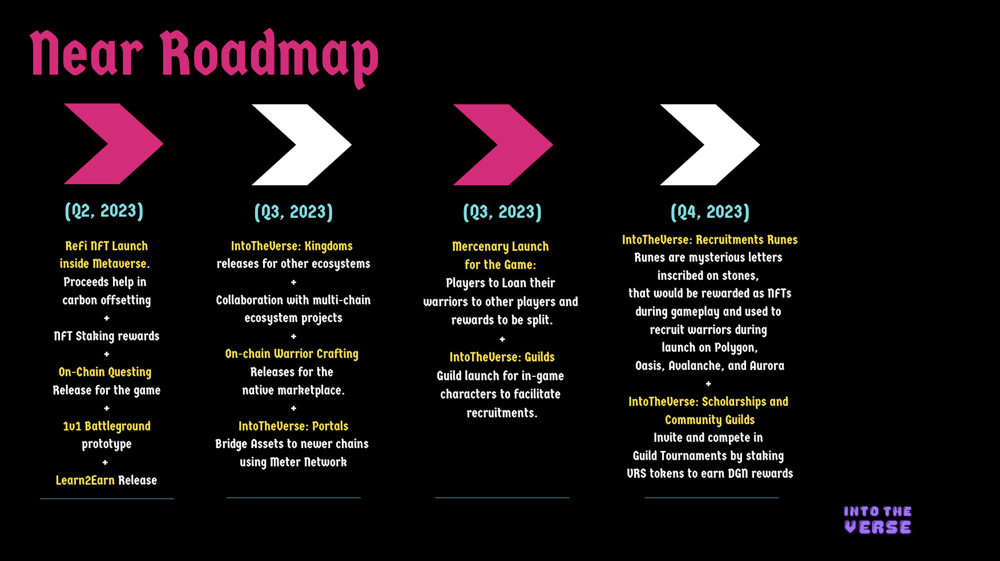

# 🏦 Bank

The banks inside our metaverse allow the civilians to swap tokens from $CELO to Celo Native stablecoins like $cUSD and $cEUR to in-game tokens $DGN and $VRS and vice versa. Citizens can enter banks and visit our Tellers from **Ubeswap**, sitting at the counters. The tellers assist you with the trades at fair offers only.

**Why use the bank?**

You might want to buy items from our marketplace, own land on the metaverse, and even stake your earnings from the dungeons. The citizens of our metaverse have long been using $VRS and $DGN tokens for trade in the city, ever since they started mining from the mines inside the dungeons. Therefore, it is recommended to swap tokens with the Tellers at the counter for use inside the city.
