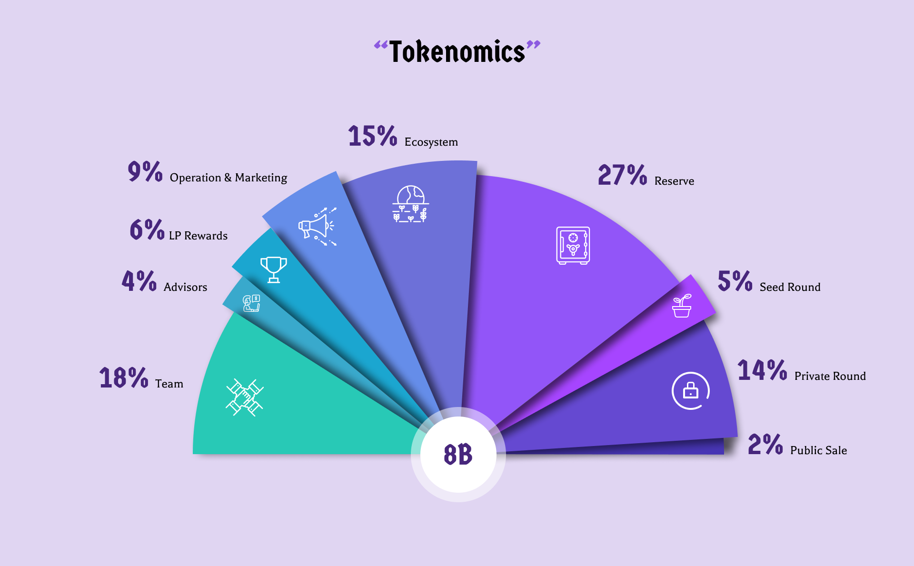

# 📈 Tokenomics

### **Token information** 

|                                |                                   |
| ------------------------------ | --------------------------------- |
| **Type**                       | Governance Token for IntoTheVerse |
| **Ticker**                     | VRS                               |
| **Maximum Supply**             | 8,000,000,000 VRS (FIXED)         |
| **Token Contract**             | TBD                               |
|                                |                                   |
| **Initial circulating supply** | 292,000,000 VRS                   |
| **Initial market cap**         | $2,628,000 USD                    |
|                                |                                   |
| **Seed sale price**            | $0.003 USD                        |
| **Private sale price**         | $0.005 USD                        |
| **Public sale price**          | $0.009 USD                        |

### Vesting Schedule

| Category                   | Supply | Tokens        | TGE and Vesting                                                    |
| -------------------------- | ------ | ------------- | ------------------------------------------------------------------ |
| **Seed Round**             | 5.00%  | 400,000,000   | 
6 months cliff 18 months vesting, linear unlock @ 5.50%
  |
| **Private Sale**           | 14.00% | 1,120,000,000 | 
6 months cliff 18 months vesting, linear unlock @ 5.50%
  |
| **Public Raise**           | 2.00%  | 160,000,000   | 
TGE: 40% unlocked 15% quarterly unlock
                   |
| **LP Rewards**             | 6.00%  | 480,000,000   | 
TGE 10% unlocked 36 month vesting, linear unlock @ 2.5%
  |
| **Reserve**                | 27.00% | 2,160,000,000 | 
12 months cliff 40 months vesting, linear unlock @ 2.50%
 |
| **Ecosystem**              | 15.00% | 1,200,000,000 | 
24 months cliff 28 months vesting, linear unlock @ 3.75%
 |
| **Operations & Marketing** | 9.00%  | 720,000,000   | 
TGE: 25% unlocked From M2-10: 5% From M11-20: 3%
         |
| **Team**                   | 18.00% | 1,440,000,000 | 
12 months cliff 40 months vesting, linear unlock @ 2.50%
 |
| **Partners & Advisors**    | 4%     | 320,000,000   | 
12 months cliff 40 months vesting, linear unlock @ 2.50%
 |

